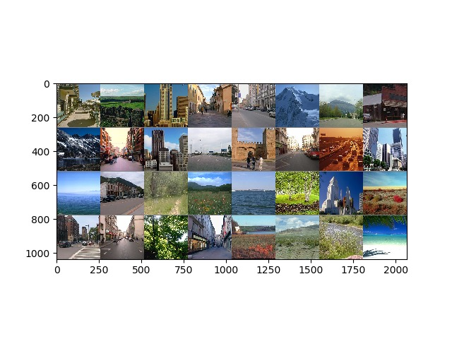

# M5 Project: Object Detection and Segmentation
## Group 00

### Team members:
* _Adam Szummer_ - a.szummer@gmail.com - [VanillaTiger](https://github.com/VanillaTiger)
* _Sergi Garcia Sarroca_ - sergi.garciasa@e-campus.uab.cat - [SoftonCV](https://github.com/SoftonCV)
* _Antoni Rodriguez Villegas_ - rv.antoni@hotmail.com - [antoniRodriguez](https://github.com/antoniRodriguez)

• Link to the Overleaf article (non-editable): https://www.overleaf.com/read/dscbpxyptkgk

# Week 1: Hands on Pytorch -- First Approach. 

#### Dataset
MIT_Split

The principal task is to adapt the model developed on M3 _DogNet_ from Keras to Pytorch.

Inside `week1/` are the files `pytorch_code.py` and `keras_code.py` with the same Neural Network architecture implemented in pytorch and keras respectively.

Tasks found in the slides: 

    - [x] NN architecture description. 

    - [x] Description of hyperparameters used. 
    
    - [x] Plot of the results.
    
    - [x] Compare and coment results. 

Slides for the project: [T00-Google Slides](https://docs.google.com/presentation/d/168WuMJ9_a1F9izG4Hv8KKOOaSKxPYy9ZMeuMJu1RFOA/edit)

